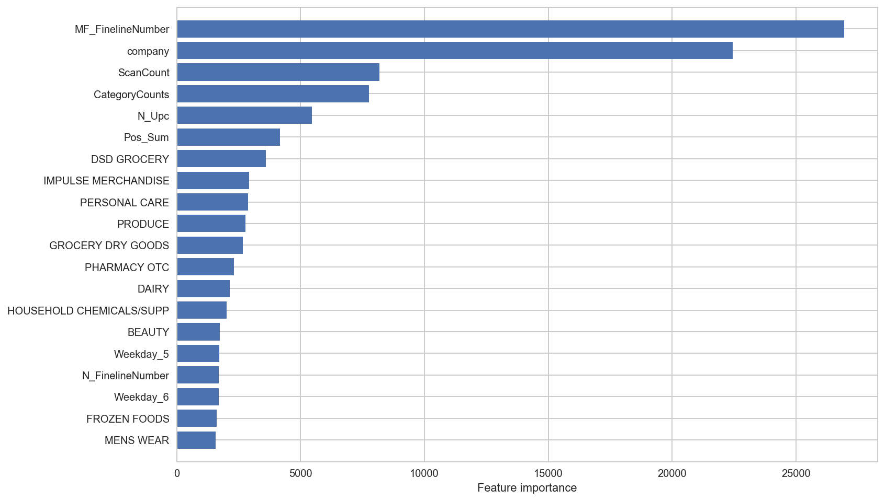

# [Walmart Recruiting: Trip Type Classification](https://github.com/novdov/dss7_SWYA_walmart/blob/master/main/2%ED%8C%80(SWYA)_B_%EB%B0%9C%ED%91%9C%EC%9E%90%EB%A3%8C.ipynb)

## Classification Team Project

### Data Science School 7th Team B-2

Competition Source: [Kaggle Competition - Walmart Recruiting: Trip Type Classification](https://www.kaggle.com/c/walmart-recruiting-trip-type-classification#description)

- Language: Python
- Classificatoin: scikit-learn, XGBoost

### Overview

- Subject: Walmart Trip Type Classification
- Dataset: Walmart
- Objective: Classification of each customers' TripType based on thier data
- Evaluation: multi-class logarithmic loss (cross entropy)

### Data fields

| Index | Feature               | Description                                  | Unique |
|-------|-----------------------|----------------------------------------------|--------|
| 1     | TripType              | A categorical id representing the type of shopping trip the customer made.                                       | 38     |
| 2     | VisitNumber           | An id corresponding to a single trip by a single customer                              | 95674  |
| 3     | Weekday               | The weekday of the trip                    | 7      |
| 4     | Upc                   | The UPC number of the product purchased                  | 97715  |
| 5     | ScanCount             | The number of the given item that was purchased. A negative value indicates a product return          | 39     |
| 6     | DepartmentDescription | A high-level description of the item's department                                | 69     |
| 7     | FinelineNumber        | A more refined category for each of the products, created by Walmart | 5196   |

## Contents

### 1. EDA & Preprocessing

- Indication of Null data (UPC, DepartmentDescription, FinelineNumber)
- Distribution of TripType on Weekday
- Comparison of most frequent and least frequent TripType
- Distrubution of DepartmentDescription on TripType
- Manual intepretation of some TripType (e.g.) TripType 999: trip for return)
- Pivot table by VisitNumber

### 2. Feature Engineering

- UPC decoding
- ScanCount separation
- Feature encoding
- One-hot encoding
- Identification of  most frequently purchased items each VisitNumber

### 3. Modeling
- [XGBoost (eXtreme Gradient Boosting)](https://github.com/dmlc/xgboost)

### 4. Results

- Feature importances
  - Features can distinguish each trip have high importance
    - FinelineNumber most frequently appear each visit
    - company code from UPC
  - TripType is also affected by counts realted features
    - ScanCount (The number of items customer purchased)
    - The number of category
    - The number of UPC
    - Pure sum of ScanCount
- Accuracy: 73.73%

### 5. Kaggle Submission
- Total Teams : 1,047 teams
- Final Score (Metric: Cross Entropy): 0.79154
- Leaderboard : 294/1,047 (top 30%)

### 6. Lessons & Limitations

- EDA & Feature Engineering
    - Except MF_FinelineNumber and company, other features can affect model not found.
    - Various numerical features from ScanCount (mean, min, max, min-max) didn't have remarkable importance.
      - Suspecting multicollinearity
    - Increasing features didn't work well. (Better performance: 85 features than 300-600 features)
      - e.g.) Better performance: MF_FinelineNumber than top 300 FinelineNumbers
    - Need to learn how to deal with few features.

- Modeling
    - Lack of hyperparameter tuning
      - Sophisticated EDA is required
    - Not tried ensemble of various models.

